# 🛡️ Maquette d'Infrastructure Entreprise Sécurisée (Homelab AD / pfSense / GPO / Backup)

## 📌 Présentation du Projet
Ce projet consiste en la conception, l'interconnexion et la sécurisation d'une infrastructure réseau et système d'entreprise virtualisée. 
L'objectif est de démontrer les compétences d'**Administration Systèmes et Réseaux (ASR)** : découpage réseau sur pare-feu, annuaire Active Directory, déploiement centralisé par GPO, serveur de fichiers avec gestion des autorisations NTFS, stratégie de sauvegarde d'urgence, script d'automatisation d'intégration de utilisateur à l'AD, serveur web isolé dans une DMZ. Ce projet est réalisé sur Hyper-V avec pour seul hôte mon PC personnel. 

---

## 📐 Architecture & Topologie Réseau

<picture>
  <!-- Image affichée en Mode Sombre -->
  <source media="(prefers-color-scheme: dark)" srcset="./docs/images/Lablanc.drawio.png">
  
  <!-- Image affichée en Mode Clair (par défaut) -->
  <source media="(prefers-color-scheme: light)" srcset="./docs/images/Lab.drawio.png">
  
  <!-- Image de secours si le navigateur ne gère pas la balise -->
  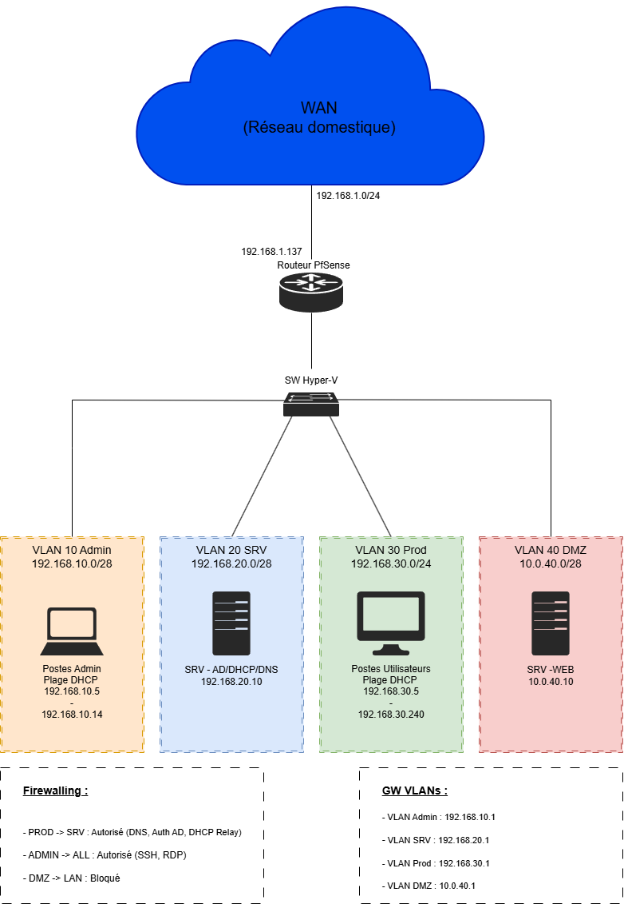
</picture>
   

## 📋 Tableau de Synthèse d'Infrastructure

| Équipement | VM OS | Adresse IP | VLAN Rôle & Services |
| :--- | :---: | :---: | :--- |
| pfSense | FreeBSD | WAN 192.168.1.137 / LAN RoaS | Pare-feu, routage, filtrage |
| PC-ADMIN | Windows Client | DHCP | Poste d'administration |
| SRV-AD | Windows Server |192.168.20.10 |AD, DHCP, DNS, Partage de Fichiers, Backup |
| PC-PROD | Windows Client | DHCP | Simulation poste utilisateurs |
| SRV-WEB | Linux |10.0.40.10 |Serveur Web |

---

## 🔒 1. Sécurité Réseau & Filtrage (pfSense)
Plutôt que d'autoriser tout le trafic LAN sans restriction, le pare-feu est configuré selon le principe du moindre privilège :    
 Filtrage des flux entrants/sortants : Suppression des règles permissives de base (Default ANY).    
* **Ouverture ciblée des flux :**    
  * ACL VLAN ADMIN   
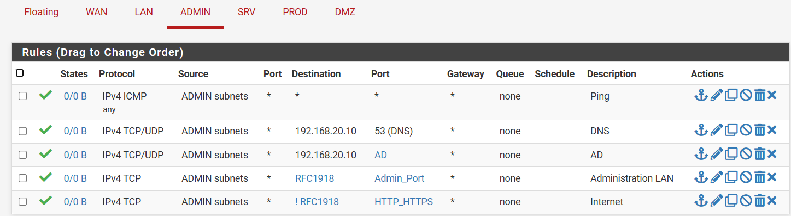    
  * ACL VLAN Serveur    
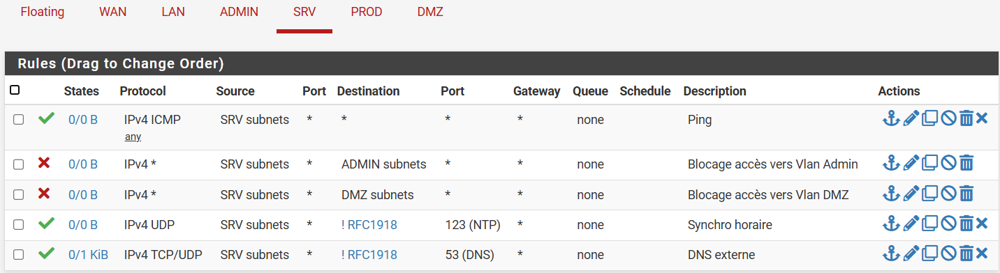    
  * ACL VLAN PROD  
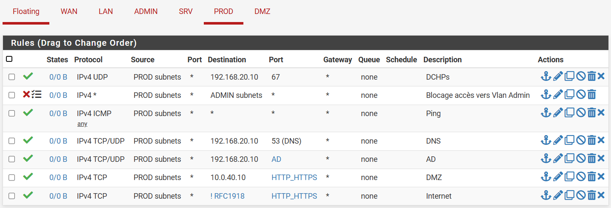    
  * ACL VLAN DMZ    
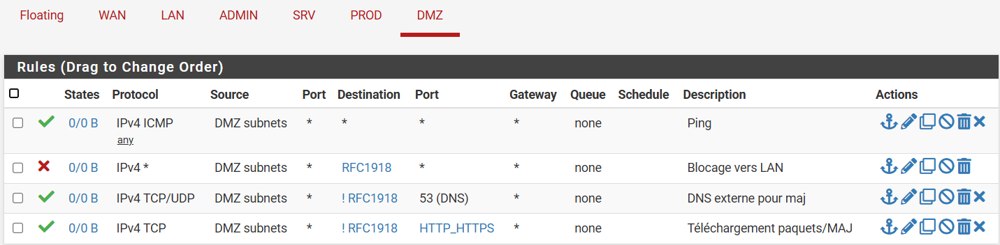   
**Traduction d'adresses :**    
  * Source NAT / Outbound PAT : Mis en place pour permettre à l'ensemble de équipements des différents VLANs privés d'accéder au réseau externe en partageant une unique adresse IP WAN.   
  * Destination NAT / Inbound PAT : Configuré pour réorienter de manière ciblée le trafic entrant sur des ports spécifiques vers le serveur web situé dans la DMZ.    

* **Relais DHCP :**
Dans une architecture segmentée en VLANs, les requêtes d'adressage dynamique (DHCP Discover) sont émises sous forme de broadcast, qui sont naturellement bloqués par le routeur de chaque sous-réseau. Un relais DHCP a donc été configuré sur le routeur pour les VLAN Admin et Prod.

**Difficultés rencontrés / Remarques :**
Par défaut le routeur Pfsense bloque les réseaux privé domestique. Lors de la configuration du routeur bien que j'ai désactivé le blocage des adresses privée et bogon. Cependant, par sécurité, l'interface WAN a une politique de filtrage qui bloque tout par défaut ce qui m'empêchait de me connecter sur l'interface WAN. J'ai donc du creer une règle de filtrage autorisant mon PC personnel à s'y connecter.     

---

## 🏢 2. Active Directory & Services Réseau (SRV-AD)

Mise en place du cœur de l'annuaire d'entreprise et des services d'infrastructure de base :

* **Services Installés :**
  * **AD DS :** Domaine principal `fofana.lab`.
  * **DNS :** Gestion de la résolution de noms interne et des zones de recherche directe/inverse.
  * **DHCP :** Gestion de l'adressage IP dynamique relayé par pfSense pour les sous-réseaux clients.

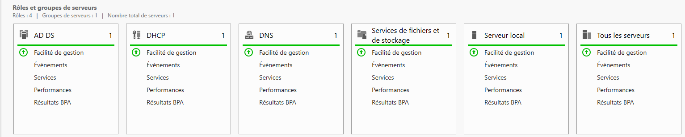
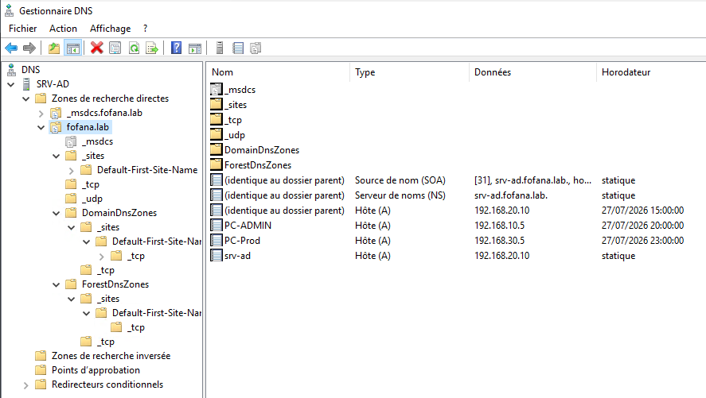
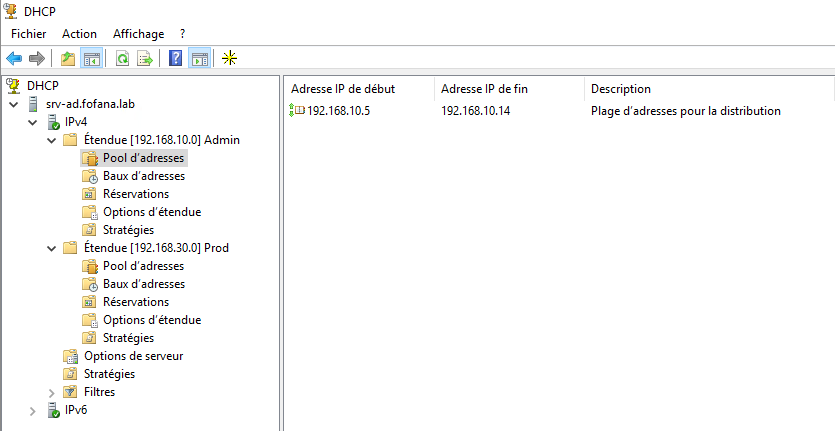
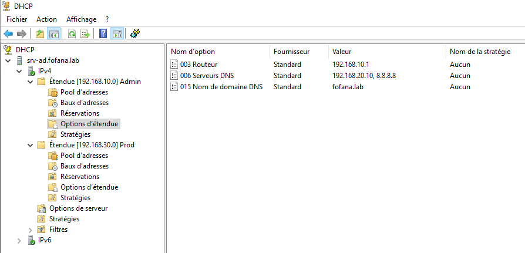

* **Arborescence des Unités d'Organisation (UO) :**
  * Organisation structurée pour préparer l'application des stratégies de groupe (`Fofana` > `Utilisateurs`, `Groupes`, `Ordinateurs`, `Serveurs`).

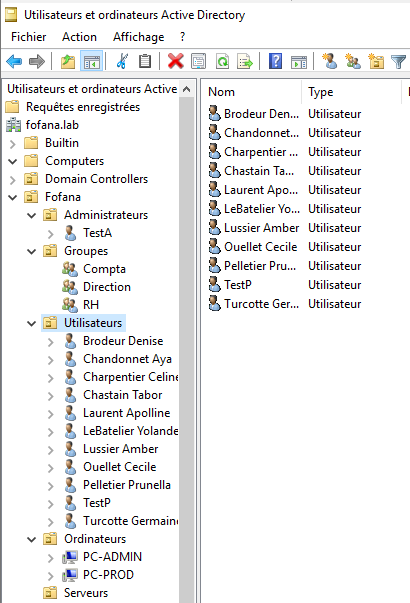

* **Difficultés rencontrées / Remarques :**
  * Après la création d'une étendu le service DHCP ne s'active pas automatiquement il faut l'activer manuellement
  * Ajout du serveur web après création de celui-ci
  * Ajout d'un serveur DNS publique dans les Redirecteurs 

---

## ⚡ 3. Automatisation & Scripting PowerShell

Automatisation de l'intégration des collaborateurs pour éviter la création manuelle et réduire les erreurs humaines :

* **Script d'importation massive (`.ps1`) :**
  * Lecture automatique d'un fichier source `.csv` contenant les identités des nouveaux employés.
  * Création automatique des comptes utilisateurs Active Directory dans les bonnes UO.
  * Attribution des groupes de sécurité et création dynamique de leur dossier personnel avec droits NTFS adaptés.
 
📜 [Cliquez ici pour consulter le script PowerShell complet](./docs/scripts/ScriptAddUser.ps1)

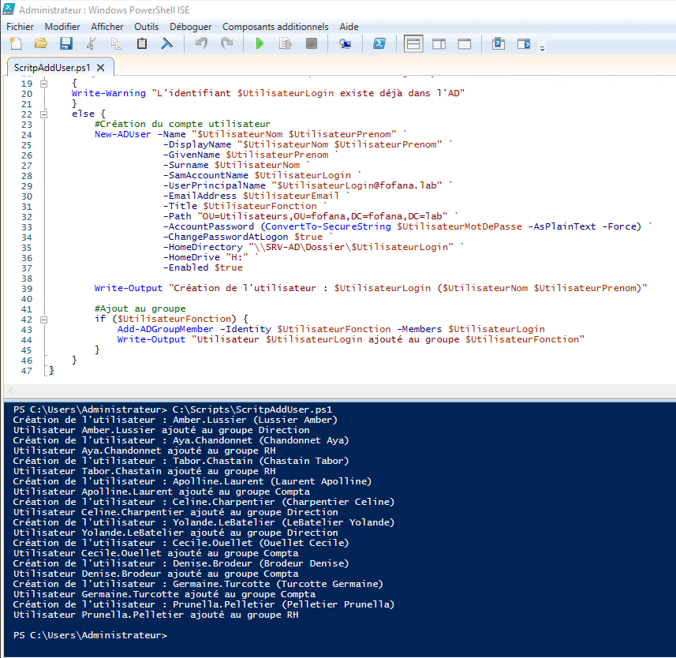

** Difficultés rencontrées / Remarques :**

Recherche de certaines commandes comme l'ajout du lecteur réseau ou au groupe sur internet et intelligence artificiel et utilisation d'un point de contrôle avant l'exécution du script. 

---

## ⚙️ 4. Stratégies de Groupe (GPO) & Durcissement (Hardening)
Sécurisation centralisée du parc de machines et automatisation de l'environnement de travail utilisateur :

* **GPOs de Sécurité (Hardening) :**

  * Politique de mot de passe : Exigence de complexité, 12 caractères min., et verrouillage de compte après 5 tentatives infructueuses (Default Domain Policy).

  * Restriction Outils Système : Blocage de l'accès à l'invite de commande (cmd.exe) et à l'éditeur de registre (regedit.exe) pour les comptes non-admin.

* **GPOs de Configuration Utilisateur :**

  * Mappage de lecteur réseau (Z:) : Montage automatique du partage de fichiers au démarrage.

  * Déploiement Logiciel : Automatisation de l'installation de 7zip .msi au démarrage de la machine.

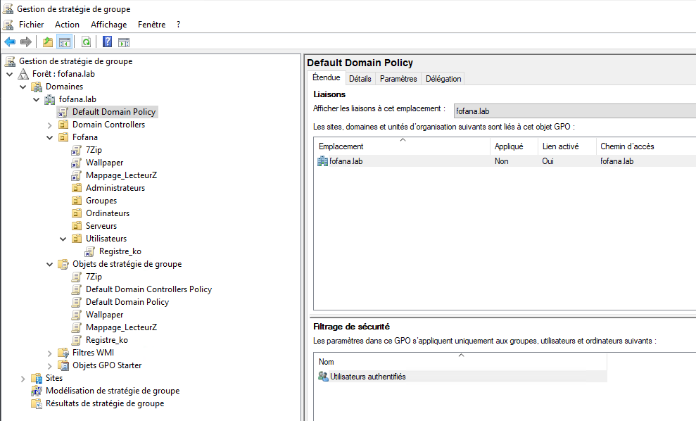

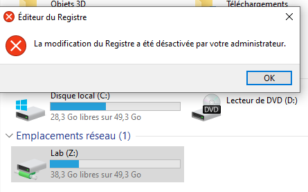 

**Difficultés rencontrées / Remarques :**
Recherche de l'emplacement de certaines paramètres de GPO sur internet

---

## 💾 5. Sauvegarde & Plan de Continuité (System State AD)
Mise en place d'une stratégie de sauvegarde pour le contrôleur de domaine (Active Directory) :

* **Sauvegarde d'État du Système (System State) :**
  * Utilisation de l'outil natif `Windows Server Backup`.
  * Protection intégrale de la base Active Directory, du répertoire `SYSVOL`, du Registre et des zones DNS.
  * Planification automatisée vers un volume disque dédié.

* **Précautions & Bonnes Pratiques appliquées :**
  * Activation de la **Corbeille Active Directory** pour la restauration rapide d'objets supprimés sans interruption de service.
  * Isolement du volume de sauvegarde pour prévenir les altérations.

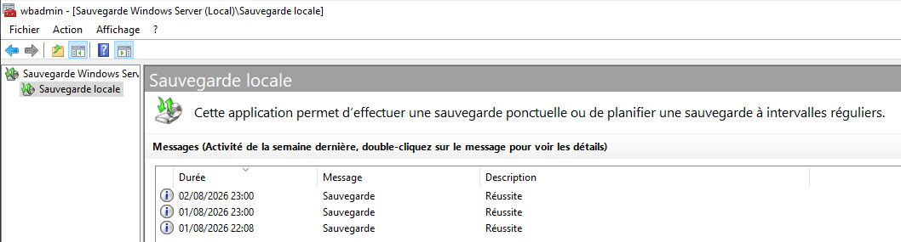

**Difficultés rencontrées / Remarques :**
Cette manipulation à nécessité d'ajouter un volume disque virtuel dédié non inclus dans la sauvegarde pour pouvoir stocker l'image System State.

---

## 🐧 6. Zone Démilitarisée (DMZ) & Serveur Web Linux (SRV-WEB)
Isolation d'un service accessible ou destiné à l'externe pour protéger le réseau interne (LAN) :

Déploiement du Serveur Web :

Installation d'un serveur Web Linux (Nginx) sur la zone DMZ (10.0.40.10).

Enregistrement du pointeur DNS interne (intranet.fofana.lab).

Exclusion stricte de toute initiation de flux depuis la DMZ vers le LAN (sécurité pfSense).

Sauvegarde Automatisée du Serveur Web (Bash) :

Écriture d'un script Bash de sauvegarde (backup_web.sh) permettant d'archiver la configuration du serveur Web.

Automatisation de l'exécution via une tâche planifiée (cron).

📜 [Cliquez ici pour consulter le script Bash complet](./docs/scripts/backup_web.sh)

**Difficultés rencontrées / Remarques :**
  * Le prompt de la page web a été configuré par l'intelligence artificielle
  * Les droits du script doivent être modifié afin de le rendre exécutable
  * La page web est également accessible depuis mon poste personnel via l'adresse de l'interface WAN du routeur
