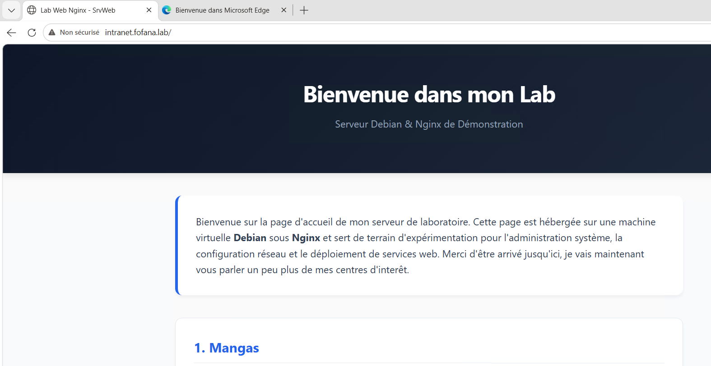
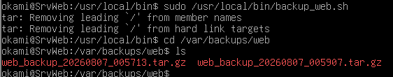

Isolation d'un service accessible ou destiné à l'externe pour protéger le réseau interne (LAN) :

Déploiement du Serveur Web :

Installation d'un serveur Web Linux (Nginx) sur la zone DMZ (10.0.40.10).

Enregistrement du pointeur DNS interne (intranet.fofana.lab).

Exclusion stricte de toute initiation de flux depuis la DMZ vers le LAN (sécurité pfSense).

Sauvegarde Automatisée du Serveur Web (Bash) :

Écriture d'un script Bash de sauvegarde (backup_web.sh) permettant d'archiver la configuration du serveur Web.

Automatisation de l'exécution via une tâche planifiée (cron).

📜 [Cliquez ici pour consulter le script Bash complet](./scripts/backup_web.sh)

!!! warning Difficultés rencontrées / Remarques :
  * Le prompt de la page web a été configuré par l'intelligence artificielle
  * Les droits du script doivent être modifié afin de le rendre exécutable
  * La page web est également accessible depuis mon poste personnel via l'adresse de l'interface WAN du routeur
